Data visualization with `ggplot2`
================
Benjamin Soltoff
2021-10-06

-   [Loading required items](#loading-required-items)
-   [Plotting with `ggplot2`](#plotting-with-ggplot2)
-   [Building your plots iteratively](#building-your-plots-iteratively)
-   [Boxplot](#boxplot)
-   [Barplot](#barplot)
-   [Adding labels and titles](#adding-labels-and-titles)
-   [Modifying scales](#modifying-scales)
-   [Faceting](#faceting)
-   [`ggplot2` themes](#ggplot2-themes)
-   [Customization](#customization)
-   [Saving graphs](#saving-graphs)
-   [Session information](#session-information)

# Loading required items

We start by loading the required package. `ggplot2` is included in the
`tidyverse` package, which is itself a collection of packages using a
common design philosophy. All of the `tidyverse` packages integrate and
work well with each other.

``` r
library(tidyverse)
```

Today we will use a dataset originally generated by
[FiveThirtyEight](https://fivethirtyeight.com/features/the-dollar-and-cents-case-against-hollywoods-exclusion-of-women/)
which evaluated gender biases in Hollywood films.

> One of the most enduring tools to measure Hollywood’s gender bias is a
> test originally promoted by cartoonist [Alison
> Bechdel](http://dykestowatchoutfor.com/) in a 1985 strip from her
> “Dykes To Watch Out For” series. Bechdel said that if a movie can
> satisfy three criteria — there are at least two named women in the
> picture, they have a conversation with each other at some point, and
> that conversation isn’t about a male character — then it passes “The
> Rule,” whereby female characters are allocated a bare minimum of
> depth. You can see a [copy of that strip
> here](http://www.npr.org/templates/story/story.php?storyId=94202522).

Bechdel test ratings are available for a wide range of movies released
between 1970-2020, while the version of the data we use here includes
additional variables such as IMDB scores, budget/gross revenue, and
ratings from 1970-2013. You can view the [codebook for the data
here](https://github.com/rfordatascience/tidytuesday/tree/master/data/2021/2021-03-09#data-dictionary).

To load the data file, run the code below:

``` r
bechdel <- read_csv("data/bechdel.csv")
```

``` r
glimpse(bechdel)
## Rows: 1,751
## Columns: 9
## $ year        <dbl> 2013, 2012, 2013, 2013, 2013, 2013, 2013, 2013, 2013, 2013…
## $ imdb        <chr> "tt1711425", "tt1343727", "tt2024544", "tt1272878", "tt045…
## $ title       <chr> "21 &amp; Over", "Dredd 3D", "12 Years a Slave", "2 Guns",…
## $ clean_test  <chr> "notalk", "ok", "notalk", "notalk", "men", "men", "notalk"…
## $ binary      <chr> "FAIL", "PASS", "FAIL", "FAIL", "FAIL", "FAIL", "FAIL", "P…
## $ budget_2013 <dbl> 1.30e+07, 4.57e+07, 2.00e+07, 6.10e+07, 4.00e+07, 2.25e+08…
## $ rated       <chr> NA, NA, "R", "R", "PG-13", "PG-13", "R", "R", "PG-13", "PG…
## $ metascore   <dbl> NA, NA, 97, 55, 62, 29, 28, 55, 48, 33, 90, 58, 52, 78, 83…
## $ imdb_rating <dbl> NA, NA, 8.3, 6.8, 7.6, 6.6, 5.4, 7.8, 5.7, 5.0, 7.5, 7.4, …
```

# Plotting with `ggplot2`

`ggplot2` is a plotting package that makes it simple to create complex
plots from data stored in a data frame. It provides a programmatic
interface for specifying what variables to plot, how they are displayed,
and general visual properties. Therefore, we only need minimal changes
if the underlying data change or if we decide to change from a bar plot
to a scatterplot. This helps in creating publication quality plots with
minimal amounts of adjustments and tweaking.

`ggplot2` functions work best with data in the ‘long’ format, i.e., a
column for every dimension, and a row for every observation.
Well-structured data will save you lots of time when making figures with
`ggplot2`. Data wrangling is it’s own challenge, and there are useful
tools in the `tidyverse` that help with this task. For today, we will
assume the data is already in the appropriate format.

ggplot graphics are built step by step by adding new elements. Adding
layers in this fashion allows for extensive flexibility and
customization of plots.

Each chart built with `ggplot2` must include the following

-   Data  
-   Aesthetic mapping (aes)
    -   Describes how variables are mapped onto graphical attributes  
    -   Visual attribute of data including x-y axes, color, fill, shape,
        and alpha  
-   Geometric objects (geom)
    -   Determines how values are rendered graphically, as bars
        (`geom_bar`), scatterplot (`geom_point`), line (`geom_line`),
        etc.

Thus, the template for graphics in ggplot2 is:

``` r
ggplot(data = <DATA>, mapping = aes(<MAPPINGS>)) +
  <GEOM_FUNCTION>()
```

`ggplot()` is a function that expects a data frame to be the first
argument.

-   use the `ggplot()` function and bind the plot to a specific data
    frame.

    ``` r
    ggplot(data = bechdel)
    ```

-   define a mapping (using the aesthetic (`aes`) function), by
    selecting the variables to be plotted and specifying how to present
    them in the graph, e.g. as x/y positions or characteristics such as
    size, shape, color, etc.

    ``` r
    ggplot(data = bechdel, mapping = aes(x = budget_2013, y = rating))
    ```

-   add ‘geoms’ – graphical representations of the data in the plot
    (points, lines, bars). `ggplot2` offers many different geoms; we
    will use some common ones today, including:

    -   `geom_point()` for scatter plots, dot plots, etc.
    -   `geom_boxplot()` for, well, boxplots!
    -   `geom_line()` for trend lines, time series, etc.

To add a geom to the plot use the `+` operator. Because we have two
continuous variables, let’s use `geom_point()` first:

``` r
ggplot(data = bechdel, mapping = aes(x = budget_2013, y = imdb_rating)) +
  geom_point()
```

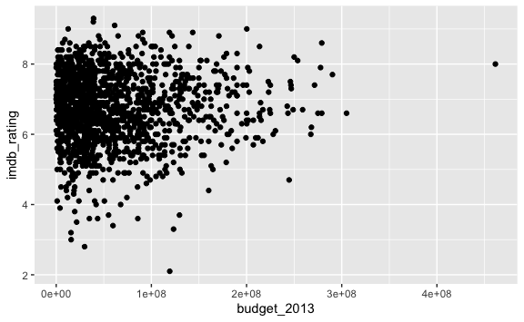

The `+` in the `ggplot2` package is particularly useful because it
allows you to modify existing `ggplot` objects. This means you can
easily set up plot templates and conveniently explore different types of
plots, so the above plot can also be generated with code like this:

``` r
# Assign plot to a variable
ratings_plot <- ggplot(data = bechdel, mapping = aes(x = budget_2013, y = imdb_rating))

# Draw the plot as a dot plot
ratings_plot +
  geom_point()
```

#### Notes

-   Anything you put in the `ggplot()` function can be seen by any geom
    layers that you add (i.e., these are universal plot settings). This
    includes the x-and y-axis mapping you set up in `aes()`.

-   You can also specify mappings for a given geom independently of the
    mapping defined globally in the `ggplot()` function.

-   The `+` sign used to add new layers must be placed at the end of the
    line containing the *previous* layer. If, instead, the `+` sign is
    added at the beginning of the line containing the new layer,
    `ggplot2` will not add the new layer and will return an error
    message.

    ``` r
    ## This is the correct syntax for adding layers
    ratings_plot +
      geom_point()

    ## This will not add the new layer and will return an error message
    ratings_plot
    + geom_point()
    ```

# Building your plots iteratively

Building plots with `ggplot2` is typically an iterative process. We
start by defining the dataset we will use, lay out the axes, and choose
a geom:

``` r
ggplot(data = bechdel, mapping = aes(x = budget_2013, y = imdb_rating)) +
  geom_point()
```


Then, we start modifying this plot to extract more information from it.
For instance, when inspecting the plot we notice that points appear
clustered on the lower end of the budget and IMDB ratings between five
and eight. This should lead us to believe that there may be multiple
observations plotted on top of each other in this region. That makes it
difficult to evaluate any patterns or trends between the variables.

There are a few ways to alleviate overplotting issues:

1.  Jittering the location of the points
2.  Changing the transparency of the points
3.  Overlaying a smoothing line

Let’s first explore option 1. We can jitter the points on the plot, so
that we can see each point in the locations where there are overlapping
points. Jittering introduces a little bit of randomness into the
position of our points. You can think of this process as taking the
overplotted graph and giving it a tiny shake. The points will move a
little bit side-to-side and up-and-down, but their position from the
original plot won’t dramatically change.

We can jitter our points using the `geom_jitter()` function instead of
the `geom_point()` function, as seen below:

``` r
ggplot(data = bechdel, mapping = aes(x = budget_2013, y = imdb_rating)) +
  geom_jitter()
```


The `geom_jitter()` function allows for us to specify the amount of
random motion in the jitter, using the `width` and `height` arguments.
When we don’t specify values for `width` and `height`, `geom_jitter()`
defaults to 40% of the resolution of the data (the smallest change that
can be measured). Hence, if we would like *less* spread in our jitter
than was default, we should pick values between 0.1 and 0.4. Experiment
with the values to see how your plot changes.

``` r
ggplot(data = bechdel, mapping = aes(x = budget_2013, y = imdb_rating)) +
  geom_jitter(
    width = 0.2,
    height = 0.2
  )
```

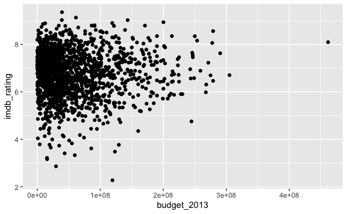

Jittering works well when there are relatively few unique values in the
observations but there are multiple observations for each combination.
Here the technique does not work very well. Instead, let’s change the
transparency of the points. What we mean when we say “transparency” we
mean the opacity of point, or your ability to see through the point. We
can control the transparency of the points with the `alpha` argument to
`geom_point`. Values of `alpha` range from 0 to 1, with lower values
corresponding to more transparent colors (an `alpha` of 1 is the default
value). Specifically, an alpha of 0.1, would make a point one-tenth as
opaque as a normal point. Stated differently ten points stacked on top
of each other would correspond to a normal point.

Here, we change the `alpha` to 0.5, in an attempt to help fix the
overplotting. While the overplotting isn’t solved, adding transparency
begins to address this problem, as the points where there are
overlapping observations are darker (as opposed to lighter gray):

``` r
ggplot(data = bechdel, mapping = aes(x = budget_2013, y = imdb_rating)) +
  geom_point(alpha = 0.5)
```

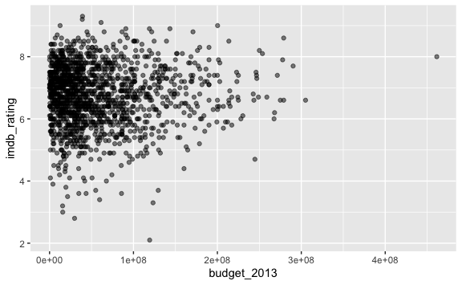

That has helped a little bit with the overplotting problem. What if we
increase the transparency even more?

``` r
ggplot(data = bechdel, mapping = aes(x = budget_2013, y = imdb_rating)) +
  geom_point(alpha = 0.2)
```

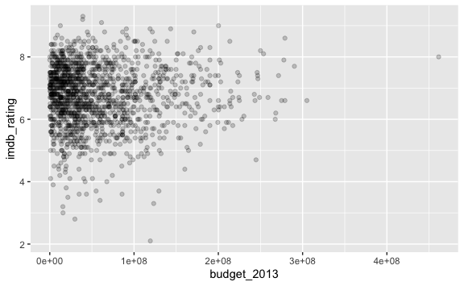

Some of the points on the outer edges of the plot start to be hard to
view, but it does emphasize the dense clustering of points.

For our final change, we can add a second geom to help summarize the
relationship between budget and rating. `geom_smooth()` implements a
flexible smoothing line for two continuous variables. To add it to the
existing graph, use another `+`:

``` r
ggplot(data = bechdel, mapping = aes(x = budget_2013, y = imdb_rating)) +
  geom_point(alpha = 0.2) +
  geom_smooth()
```

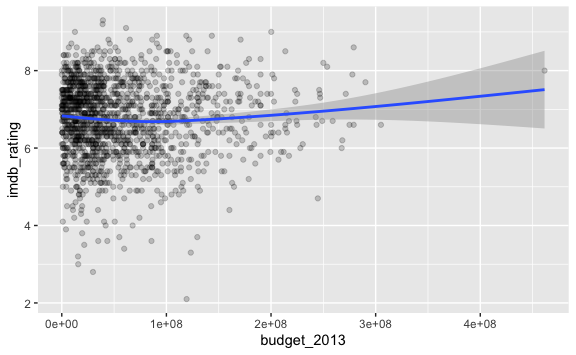

By default, the smoothing line contains a 95% confidence interval
defined by the shaded band. And since we defined our variables inside
`ggplot()`, `geom_smooth()` uses the same variables to generate the
smoothing line.

#### Exercise

Use what you just learned to create a scatter plot of `clean_test` by
`metascore`. Does this seem like a good way to display the relationship
between these variables? What other kinds of plots might you use to show
this type of data?

<details>
<summary>
Click for the solution
</summary>

``` r
ggplot(data = bechdel, mapping = aes(x = clean_test, y = metascore)) +
  geom_jitter(alpha = 0.4, width = 0.2)
```

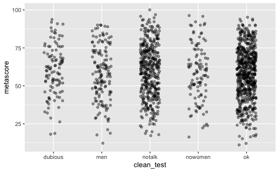

</details>

# Boxplot

We can use boxplots to visualize the distribution of `metascore` for
each Bechdel test score:

``` r
ggplot(data = bechdel, mapping = aes(x = clean_test, y = metascore)) +
  geom_boxplot()
```

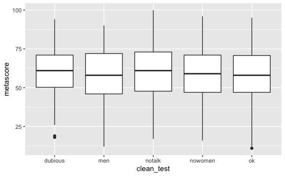

By adding points to a boxplot, we can have a better idea of the number
of measurements and of their distribution:

``` r
ggplot(data = bechdel, mapping = aes(x = clean_test, y = metascore)) +
  geom_boxplot(alpha = 0) +
  geom_jitter(
    alpha = 0.2,
    width = 0.2,
    height = 0.2
  )
```

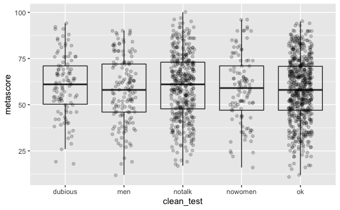

We can see that the overall distributions seem similar regardless of
Bechdel test score, but that more films seem to fall into the “notalk”
and “ok” categories instead of the other three categories.

Notice how the boxplot layer is behind the jitter layer? What do you
need to change in the code to put the boxplot in behind the points such
that it’s not hidden?

#### Exercise

Boxplots are useful summaries, but hide the *shape* of the distribution.
For example, if the distribution is bimodal, we would not see it in a
boxplot. An alternative to the boxplot is the violin plot, where the
shape (of the density of points) is drawn.

-   Replace the box plot with a violin plot; see `geom_violin()`.

    <details>
    <summary>

    Click for the solution

    </summary>

    ``` r
      ggplot(data = bechdel, mapping = aes(x = clean_test, y = metascore)) +
        geom_violin(alpha = 0) +
        geom_jitter(alpha = 0.4, width = 0.2)
    ```

    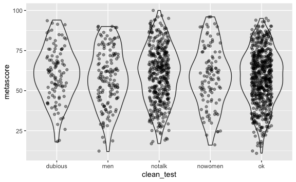

    </details>

-   So far, we’ve looked at the distribution of `metascore` within
    `clean_test`. Try making a boxplot to explore the distribution of
    `budget_2013` within `clean_test`.

    <details>
    <summary>

    Click for the solution

    </summary>

    ``` r
      ggplot(data = bechdel, mapping = aes(x = clean_test, y = budget_2013)) +
        geom_boxplot(alpha = 0) +
        geom_jitter(alpha = 0.1, width = 0.2)
    ```

    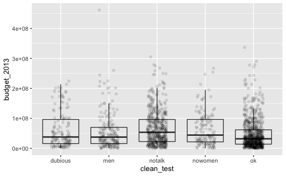

    </details>

# Barplot

Barplots are also useful for visualizing categorical data. By default,
`geom_bar` accepts a variable for x, and plots the number of instances
each value of x (in this case, wall type) appears in the dataset.

``` r
ggplot(data = bechdel, mapping = aes(x = clean_test)) +
  geom_bar()
```

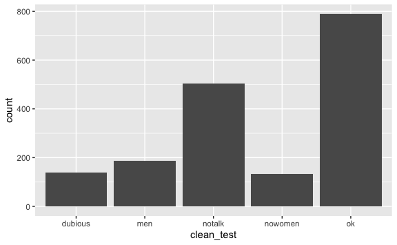

We can use the `fill` aesthetic for the `geom_bar()` geom to color bars
by the portion of each count based on a film’s rating.

``` r
ggplot(data = bechdel, mapping = aes(x = clean_test)) +
  geom_bar(mapping = aes(fill = rated))
```

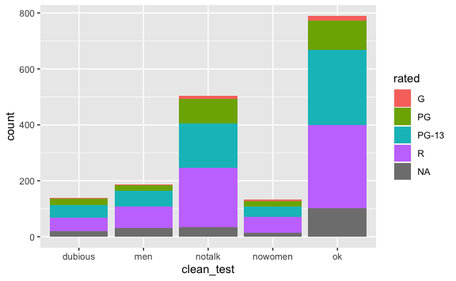

This creates a stacked bar chart. These are generally more difficult to
read than side-by-side bars. We can separate the portions of the stacked
bar that correspond to each village and put them side-by-side by using
the `position` argument for `geom_bar()` and setting it to “dodge”.

``` r
ggplot(data = bechdel, mapping = aes(x = clean_test)) +
  geom_bar(mapping = aes(fill = rated), position = "dodge")
```

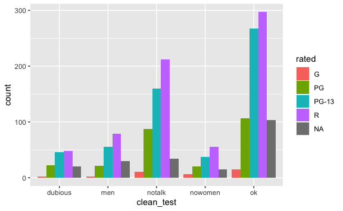

# Adding labels and titles

By default, the axes labels on a plot are determined by the name of the
variable being plotted. However, `ggplot2` offers lots of customization
options, like specifying the axes labels, and adding a title to the plot
with relatively few lines of code. We will add more informative x-and
y-axis labels to our plot, a more explanatory label to the legend, and a
plot title.

The `labs` function takes the following arguments:

-   `title` – to produce a plot title
-   `subtitle` – to produce a plot subtitle (smaller text placed beneath
    the title)
-   `caption` – a caption for the plot
-   `...` – any pair of name and value for aesthetics used in the plot
    (e.g., `x`, `y`, `fill`, `color`, `size`)

``` r
ggplot(data = bechdel, mapping = aes(x = clean_test)) +
  geom_bar(mapping = aes(fill = rated), position = "dodge") +
  labs(
    title = "Number of films earning Bechdel scores by film rating",
    fill = "MPAA rating",
    x = "Bechdel test score",
    y = "Number of films"
  )
```

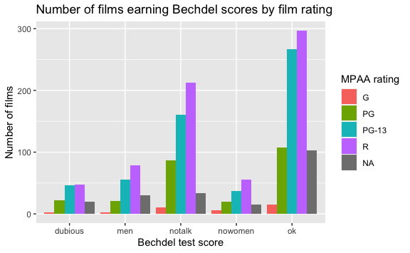

# Modifying scales

`ggplot2` uses intelligent defaults to control exactly how variables are
encoded in the graph. However it also includes functions for customizing
the appearance of these **scales**. For example, consider the
scatterplot we generated earlier examining `budget_2013` and
`imdb_rating`.

``` r
ggplot(data = bechdel, mapping = aes(x = budget_2013, y = imdb_rating)) +
  geom_point(alpha = 0.2)
```


The default scale for the x-axis uses equal interval widths between each
data point. However given the skew of film budgets, we could also decide
to visualize it using a log-transformed scale:

``` r
ggplot(data = bechdel, mapping = aes(x = budget_2013, y = imdb_rating)) +
  geom_point(alpha = 0.2) +
  scale_x_log10()
```

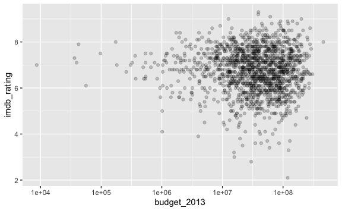

The syntax for these functions is `scale_<MAPPING>_<TYPE>()`, where the
second element is the mapping to adjust, and the final component
defining the type of scale to implement.

You can also use scales to modify the labeling or format of how the
scales are identified on the graph. Consider the current graph.
`budget_2013` is defined in terms of US dollars. To make the x-axis more
readable, we could format each tick mark label in dollars. To do so, we
need to first load the `scales` package which includes functions for
different text formatting.

``` r
library(scales)

ggplot(data = bechdel, mapping = aes(x = budget_2013, y = imdb_rating)) +
  geom_point(alpha = 0.2) +
  scale_x_log10(labels = dollar)
```


Now we can use the `dollar` format from the `scales` package to
automatically reformat all the tick mark labels.

#### Exercise

Recreate the dodged bar chart reporting the number of films by Bechdel
test score and film rating. Change the color palette to use the “Accent”
color palette from the `RColorBrewer` package.

<details>
<summary>
Click for the solution
</summary>

``` r
ggplot(data = bechdel, mapping = aes(x = clean_test)) +
  geom_bar(mapping = aes(fill = rated), position = "dodge") +
  scale_fill_brewer(palette = "Accent")
```

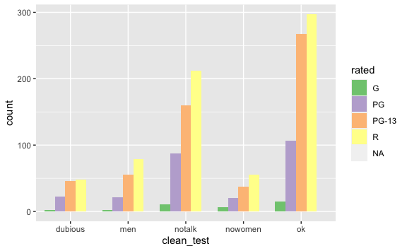

</details>

# Faceting

Rather than creating a single plot with side-by-side bars for each film
rating, we may want to create a small multiple plot, where each plot
shows the data for a single film rating.

`ggplot2` has a special technique called *faceting* that allows the user
to split one plot into multiple plots based on a factor included in the
dataset. We will use it to split our barplot of Bechdel test scores by
film rating so that each film rating has its own panel in a multi-panel
plot:

``` r
ggplot(data = bechdel, mapping = aes(x = clean_test)) +
  geom_bar() +
  facet_wrap(facets = vars(rated))
```

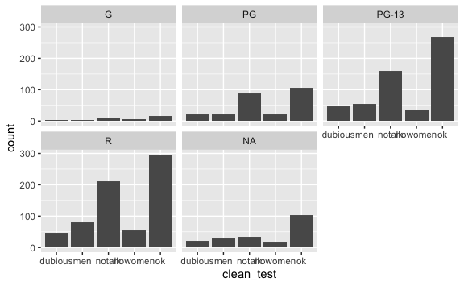

Note that due to the smaller panels, the text labels on the x-axis are
overlapping. A simple way to fix this is flip the axes so that Bechdel
test score is on the y-axis, and number of films is on the x-axis. All
we need to do is map `clean_test` to the y-axis instead of the
conventional x.

``` r
ggplot(data = bechdel, mapping = aes(y = clean_test)) +
  geom_bar() +
  facet_wrap(facets = vars(rated))
```

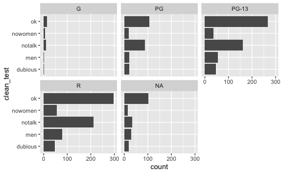

We also can see that there are very few G-rated films in the dataset.
This causes a lot of wasted space in that panel. By default each panel
has the same range for the x and y-axes. However we can adjust this to
individually determine the range for each panel:

``` r
ggplot(data = bechdel, mapping = aes(y = clean_test)) +
  geom_bar() +
  facet_wrap(facets = vars(rated), scales = "free_x")
```


Usually plots with white background look more readable when printed. We
can set the background to white using the function `theme_bw()`.
Additionally, you can remove the grid:

``` r
ggplot(data = bechdel, mapping = aes(y = clean_test)) +
  geom_bar(position = "dodge") +
  facet_wrap(facets = vars(rated), scales = "free_x") +
  theme_bw() +
  theme(panel.grid = element_blank())
```

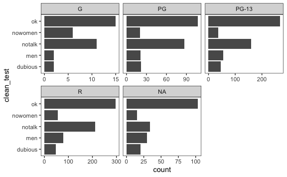

# `ggplot2` themes

In addition to `theme_bw()`, which changes the plot background to white,
`ggplot2` comes with several other themes which can be useful to quickly
change the look of your visualization. The complete list of themes is
available at <https://ggplot2.tidyverse.org/reference/ggtheme.html>.
`theme_minimal()` and `theme_light()` are popular, and `theme_void()`
can be useful as a starting point to create a new hand-crafted theme.

The [`ggthemes`](https://jrnold.github.io/ggthemes/reference/index.html)
package provides a wide variety of options (including an Excel 2003
theme). The [`ggplot2` extensions
website](https://exts.ggplot2.tidyverse.org/) provides a list of
packages that extend the capabilities of `ggplot2`, including additional
themes.

#### Exercise

Experiment with at least two different themes. Build the previous plot
using each of those themes. Which do you like best?

# Customization

Take a look at the [`ggplot2` cheat
sheet](https://github.com/rstudio/cheatsheets/blob/master/data-visualization.pdf),
and think of ways you could improve the plot.

Now, let’s change names of axes to something more informative than
‘village’ and ‘percent’ and add a title to the figure:

``` r
ggplot(data = bechdel, mapping = aes(y = clean_test)) +
  geom_bar() +
  facet_wrap(facets = vars(rated), scales = "free_x") +
  theme_bw() +
  labs(
    title = "Number of films earning Bechdel scores by film rating",
    fill = "MPAA rating",
    x = "Bechdel test score",
    y = "Number of films"
  )
```

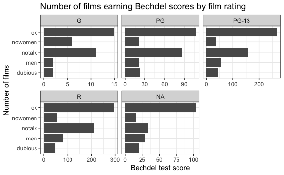

The axes have more informative names, but their readability can be
improved by increasing the font size:

``` r
ggplot(data = bechdel, mapping = aes(y = clean_test)) +
  geom_bar() +
  facet_wrap(facets = vars(rated), scales = "free_x") +
  theme_bw() +
  labs(
    title = "Number of films earning Bechdel scores by film rating",
    fill = "MPAA rating",
    x = "Bechdel test score",
    y = "Number of films"
  ) +
  theme(text = element_text(size = 14))
```

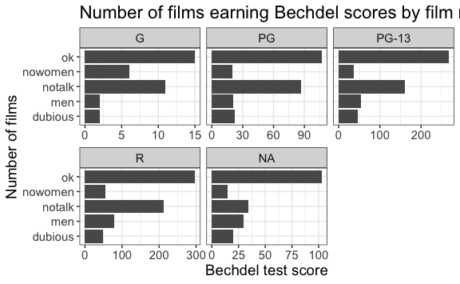

Note that it is also possible to change the fonts of your plots. If you
are on Windows, you may have to install the [`extrafont`
package](https://github.com/wch/extrafont), and follow the instructions
included in the README for this package.

With a larger font, the title also runs off. We can add “\\n” in the
string for the title to insert a new line:

``` r
ggplot(data = bechdel, mapping = aes(y = clean_test)) +
  geom_bar() +
  facet_wrap(facets = vars(rated), scales = "free_x") +
  theme_bw() +
  labs(
    title = "Number of films earning Bechdel scores\nby film rating",
    fill = "MPAA rating",
    x = "Bechdel test score",
    y = "Number of films"
  ) +
  theme(text = element_text(size = 14),
        axis.text.x = element_text(color = "grey50"),
        axis.text.y = element_text(color = "grey50"))
```

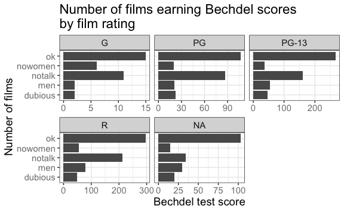

If you like the changes you created better than the default theme, you
can save them as an object to be able to easily apply them to other
plots you may create. We can also add
`plot.title = element_text(hjust = 0.5)` to center the title:

``` r
theme_bw_custom <- theme_bw() +
  theme(text = element_text(size = 14),
        axis.text.x = element_text(color = "grey50"),
        axis.text.y = element_text(color = "grey50"),
        plot.title = element_text(hjust = 0.5))

ggplot(data = bechdel, mapping = aes(y = clean_test)) +
  geom_bar() +
  facet_wrap(facets = vars(rated), scales = "free_x") +
  theme_bw() +
  labs(
    title = "Number of films earning Bechdel scores\nby film rating",
    fill = "MPAA rating",
    x = "Bechdel test score",
    y = "Number of films"
  ) +
  theme_bw_custom
```

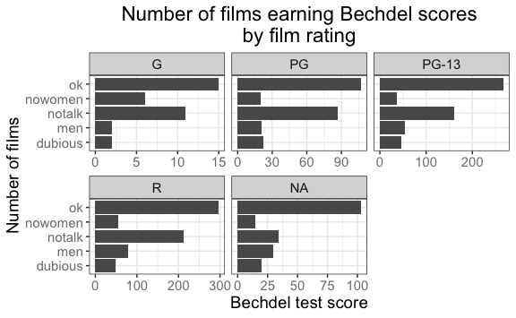

#### Exercise

With all of this information in hand, please take another five minutes
to either improve one of the plots generated in this exercise or create
a beautiful graph of your own. Use the RStudio [`ggplot2` cheat
sheet](https://github.com/rstudio/cheatsheets/blob/master/data-visualization.pdf)
for inspiration. Here are some ideas:

-   See if you can make the bars white with black outline.
-   Try using a different color palette (see
    <http://www.cookbook-r.com/Graphs/Colors_(ggplot2)/>).

# Saving graphs

After creating your plot, you can save it to a file in your favorite
format. The Export tab in the **Plot** pane in RStudio will save your
plots at low resolution, which will not be accepted by many journals and
will not scale well for posters.

Instead, use the `ggsave()` function, which allows you to easily change
the dimension and resolution of your plot by adjusting the appropriate
arguments (`width`, `height` and `dpi`).

Make sure to have the `fig_output/` folder in your working directory.

``` r
my_plot <- ggplot(data = bechdel, mapping = aes(y = clean_test)) +
  geom_bar() +
  facet_wrap(facets = vars(rated), scales = "free_x") +
  theme_bw() +
  labs(
    title = "Number of films earning Bechdel scores\nby film rating",
    fill = "MPAA rating",
    x = "Bechdel test score",
    y = "Number of films"
  ) +
  theme_bw_custom

ggsave(filename = "fig_output/name_of_file.png", plot = my_plot, width = 15, height = 10)
```

Note: The parameters `width` and `height` also determine the font size
in the saved plot.

# Session information

``` r
sessioninfo::session_info()
## ─ Session info ───────────────────────────────────────────────────────────────
##  setting  value                       
##  version  R version 4.1.0 (2021-05-18)
##  os       macOS Big Sur 10.16         
##  system   x86_64, darwin17.0          
##  ui       X11                         
##  language (EN)                        
##  collate  en_US.UTF-8                 
##  ctype    en_US.UTF-8                 
##  tz       America/Chicago             
##  date     2021-10-06                  
## 
## ─ Packages ───────────────────────────────────────────────────────────────────
##  package      * version date       lib source        
##  assertthat     0.2.1   2019-03-21 [1] CRAN (R 4.1.0)
##  backports      1.2.1   2020-12-09 [1] CRAN (R 4.1.0)
##  bit            4.0.4   2020-08-04 [1] CRAN (R 4.1.0)
##  bit64          4.0.5   2020-08-30 [1] CRAN (R 4.1.0)
##  broom          0.7.9   2021-07-27 [1] CRAN (R 4.1.0)
##  cellranger     1.1.0   2016-07-27 [1] CRAN (R 4.1.0)
##  cli            3.0.1   2021-07-17 [1] CRAN (R 4.1.0)
##  colorspace     2.0-2   2021-06-24 [1] CRAN (R 4.1.0)
##  crayon         1.4.1   2021-02-08 [1] CRAN (R 4.1.0)
##  DBI            1.1.1   2021-01-15 [1] CRAN (R 4.1.0)
##  dbplyr         2.1.1   2021-04-06 [1] CRAN (R 4.1.0)
##  digest         0.6.27  2020-10-24 [1] CRAN (R 4.1.0)
##  dplyr        * 1.0.7   2021-06-18 [1] CRAN (R 4.1.0)
##  ellipsis       0.3.2   2021-04-29 [1] CRAN (R 4.1.0)
##  evaluate       0.14    2019-05-28 [1] CRAN (R 4.1.0)
##  fansi          0.5.0   2021-05-25 [1] CRAN (R 4.1.0)
##  farver         2.1.0   2021-02-28 [1] CRAN (R 4.1.0)
##  forcats      * 0.5.1   2021-01-27 [1] CRAN (R 4.1.0)
##  fs             1.5.0   2020-07-31 [1] CRAN (R 4.1.0)
##  generics       0.1.0   2020-10-31 [1] CRAN (R 4.1.0)
##  ggplot2      * 3.3.5   2021-06-25 [1] CRAN (R 4.1.0)
##  glue           1.4.2   2020-08-27 [1] CRAN (R 4.1.0)
##  gtable         0.3.0   2019-03-25 [1] CRAN (R 4.1.0)
##  haven          2.4.3   2021-08-04 [1] CRAN (R 4.1.0)
##  here           1.0.1   2020-12-13 [1] CRAN (R 4.1.0)
##  highr          0.9     2021-04-16 [1] CRAN (R 4.1.0)
##  hms            1.1.0   2021-05-17 [1] CRAN (R 4.1.0)
##  htmltools      0.5.1.1 2021-01-22 [1] CRAN (R 4.1.0)
##  httr           1.4.2   2020-07-20 [1] CRAN (R 4.1.0)
##  jsonlite       1.7.2   2020-12-09 [1] CRAN (R 4.1.0)
##  knitr          1.33    2021-04-24 [1] CRAN (R 4.1.0)
##  labeling       0.4.2   2020-10-20 [1] CRAN (R 4.1.0)
##  lattice        0.20-44 2021-05-02 [1] CRAN (R 4.1.0)
##  lifecycle      1.0.0   2021-02-15 [1] CRAN (R 4.1.0)
##  lubridate      1.7.10  2021-02-26 [1] CRAN (R 4.1.0)
##  magrittr       2.0.1   2020-11-17 [1] CRAN (R 4.1.0)
##  Matrix         1.3-4   2021-06-01 [1] CRAN (R 4.1.0)
##  mgcv           1.8-36  2021-06-01 [1] CRAN (R 4.1.0)
##  modelr         0.1.8   2020-05-19 [1] CRAN (R 4.1.0)
##  munsell        0.5.0   2018-06-12 [1] CRAN (R 4.1.0)
##  nlme           3.1-152 2021-02-04 [1] CRAN (R 4.1.0)
##  pillar         1.6.2   2021-07-29 [1] CRAN (R 4.1.0)
##  pkgconfig      2.0.3   2019-09-22 [1] CRAN (R 4.1.0)
##  purrr        * 0.3.4   2020-04-17 [1] CRAN (R 4.1.0)
##  R6             2.5.1   2021-08-19 [1] CRAN (R 4.1.0)
##  RColorBrewer   1.1-2   2014-12-07 [1] CRAN (R 4.1.0)
##  Rcpp           1.0.7   2021-07-07 [1] CRAN (R 4.1.0)
##  readr        * 2.0.1   2021-08-10 [1] CRAN (R 4.1.0)
##  readxl         1.3.1   2019-03-13 [1] CRAN (R 4.1.0)
##  reprex         2.0.1   2021-08-05 [1] CRAN (R 4.1.0)
##  rlang          0.4.11  2021-04-30 [1] CRAN (R 4.1.0)
##  rmarkdown      2.10    2021-08-06 [1] CRAN (R 4.1.0)
##  rprojroot      2.0.2   2020-11-15 [1] CRAN (R 4.1.0)
##  rstudioapi     0.13    2020-11-12 [1] CRAN (R 4.1.0)
##  rvest          1.0.1   2021-07-26 [1] CRAN (R 4.1.0)
##  scales       * 1.1.1   2020-05-11 [1] CRAN (R 4.1.0)
##  sessioninfo    1.1.1   2018-11-05 [1] CRAN (R 4.1.0)
##  stringi        1.7.3   2021-07-16 [1] CRAN (R 4.1.0)
##  stringr      * 1.4.0   2019-02-10 [1] CRAN (R 4.1.0)
##  tibble       * 3.1.3   2021-07-23 [1] CRAN (R 4.1.0)
##  tidyr        * 1.1.3   2021-03-03 [1] CRAN (R 4.1.0)
##  tidyselect     1.1.1   2021-04-30 [1] CRAN (R 4.1.0)
##  tidyverse    * 1.3.1   2021-04-15 [1] CRAN (R 4.1.0)
##  tzdb           0.1.2   2021-07-20 [1] CRAN (R 4.1.0)
##  utf8           1.2.2   2021-07-24 [1] CRAN (R 4.1.0)
##  vctrs          0.3.8   2021-04-29 [1] CRAN (R 4.1.0)
##  vroom          1.5.4   2021-08-05 [1] CRAN (R 4.1.0)
##  withr          2.4.2   2021-04-18 [1] CRAN (R 4.1.0)
##  xfun           0.25    2021-08-06 [1] CRAN (R 4.1.0)
##  xml2           1.3.2   2020-04-23 [1] CRAN (R 4.1.0)
##  yaml           2.2.1   2020-02-01 [1] CRAN (R 4.1.0)
## 
## [1] /Library/Frameworks/R.framework/Versions/4.1/Resources/library
```
